# Lakehouse with Delta Lake

[Lakehouse with Delta Lake Deep Dive - How Delta Lake Enables a Lakehouse.webarchive](lakehouse_with_delta_lake/lakehouse_with_delta_lake_deep_dive__how_delta_lake_enables_a_lakehouse.webarchive)

## Data Warehouse

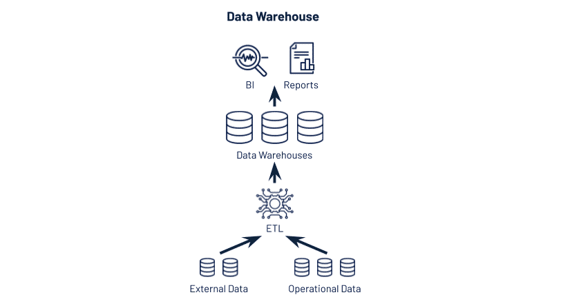

Data warehouses were purpose built for business intelligence and reporting, and they provide support for data consistency and quick ad-hoc queries. However, they're unable to store unstructured raw data. That means they cannot support many of the data science and machine learning applications that have become crucial to modern data use cases.

Because of these challenges, many organizations employ data warehouses only for smaller subsets of their data. You can see that much of their data is flowing into data storage outside of the data warehouse, and only subsets are available at the data warehouse level. This means that one of the primary problems data warehouses were intended to solve (bringing disparate databases under a single umbrella) is no longer solved.

## Data Lake

Data lakes use a variety of formats and store unstructured and semi-structured data; Apache Parquet and ORC have historically been popular formats for data lakes at scale. It’s an attractive approach, because the table is just a group of objects that can be accessed from a wide variety of tools without a lot of additional data stores or systems. However, both performance and consistency problems are common. Hidden data corruption is common due to transaction fails, eventual consistency leads to inconsistent queries, latency is high, and basic management capabilities like table versioning and audit logs are unavailable

## Dual System

We can see that data warehouses show deficiencies in working with data science or machine learning use cases, while data lakes show some deficiencies in business intelligence and reporting use cases. Naturally, some enterprises have custom built a dual system by maintaining both a data warehouse **and** a data lake.

These systems can bypass the consistency challenges of data lakes by managing the metadata in a separate, strongly consistent service that’s able to provide a single source of truth. However, all I/O operations need to connect to this metadata service, which can increase resource costs and reduce performance and availability. Additionally, it takes a lot of engineering work to implement connectors to existing computing engines like Apache Spark, TensorFlow, and PyTorch, which can be challenging for data teams that use a variety of computing engines on their data.

Engineering challenges can be exacerbated by unstructured data, because these systems are generally optimized for traditional structured data types. Finally, and most egregious, the proprietary metadata service locks customers into a specific service provider, leaving customers to contend with consistently high prices and expensive, time-consuming migrations if they decide to adopt a new approach later.

## Lakehouse

Lakehouses are enabled by a new system design: implementing similar data structures and data management features to those in a data warehouse, directly on the kind of low cost storage used for data lakes. They are what you would get if you had to redesign data warehouses in the modern world, now that cheap and highly reliable storage (in the form of object stores) are available.

# Delta Lake

Delta Lake provides a critical layer of a modern Lakehouse architecture, bringing structure and reliability to your data lakes in support of any downstream data use case.

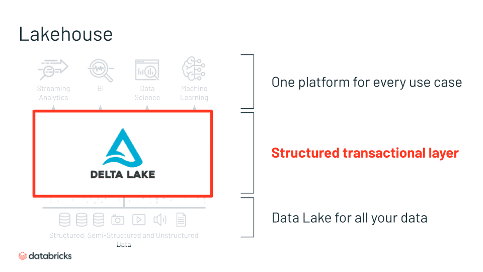

- An open source ACID table storage layer over cloud object stores
- Adds reliability, quality, performance to data lakes
- Brings the best of data warehousing and data lakes
- Based on open-source and open-format (Parquet)
- Initially developed at Databricks; open sourced in 2019

## Delta Architecture

The Delta architecture design pattern describes how raw data will be ingested, transformed, and loaded into successively more refined Delta Lake tables. The Bronze level tables hold raw data from a variety of sources, including historical ("batch") data as well as real time streaming data. We apply transformations (ETL) that allow some of that data to flow into a Silver level table, where we can save the result as a new table without modifying our original data.

An intermediate Silver table is important because it might serve as the source for multiple downstream Gold level tables, which could be controlled by different business units and users, all of whom have different needs and use cases. The Silver level allows us to transform the raw data exactly once. Then, we can apply further aggregations and feature engineering to create Gold tables that suit particular business needs.

Gold level tables contain data that is thoroughly cleaned, transformed, and ready for consumption by machine learning models and/or analytics.  Because these tables are built directly on top of our system for ingesting raw data, we can be confident in its veracity and timeliness. And, because it has been processed through this architectural pattern, we can be confident that the data stored or streamed into our final Gold tables is clean, conforming, and consistent.

## Delta Storage Layer

The Delta storage layer is a crucial part what transforms a data lake to a Delta lake.

Keeping all of your data in files in object storage is the central design pattern that defines a data lake. Working with traditional data lakes quickly exposes pain points around data cleanliness, reliability, and ability to quickly access data.  The Delta storage layer provides a structured transactional layer  on top of your existing file storage that solves the aforementioned challenges.

Delta Lake uses a transaction log that is compacted into Apache Parquet format to provide ACID properties, time travel, and significantly faster metadata operations for large tabular datasets (e.g., the ability to quickly search billions of table partitions for those relevant to a query).

Working with Delta Lake allows whole data teams to work within a single system, where data is reliable, current, and easy to access.

## Delta Engine

Delta Engine is a high performance, Apache Spark compatible query engine built into Databricks Runtime (DBR)  since the release of DBR 7.0.  It provides an efficient way to process data in data lakes including data stored in open source Delta Lake. It performs file management optimizations, performance optimizations with Delta Caching, dynamic file pruning, and adaptive query execution.

Delta Engine accelerates the performance of Delta Lake for SQL and data frame workloads through three components: an improved query optimizer, a caching layer that sits between the execution layer and the cloud object storage, and a native vectorized execution engine that’s written in C++.

The improved query optimizer extends the functionality already in Spark 3.0 (cost-based optimizer, adaptive query execution, and dynamic runtime filters) with more advanced statistics to deliver up to 18x increased performance in star schema workloads.

Delta Engine’s caching layer automatically chooses which input data to cache for the user, transcoding it along the way in a more CPU-efficient format to better leverage the increased storage speeds of NVMe SSDs. This delivers up to 5x faster scan performance for virtually all workloads.

However, the biggest innovation in Delta Engine is the native execution engine: Photon. This completely rewritten execution engine for Databricks has been built to maximize the performance from the new changes in modern cloud hardware. It brings performance improvements to all workload types, while remaining fully compatible with open Spark APIs.

## Delta Table Components

### Delta Files

Delta Lake uses Parquet files stored in object storage. Apache Parquet is designed for efficient and performant flat columnar storage of data, compared to row based files like CSV or TSV files.

### Transaction Log

The transaction log makes it possible for multiple readers and writers on a given Delta table to work at the same time. It serves as a **single source of truth** - a central repository that tracks all changes that users make to a table.

When a user reads a Delta Lake table for the first time or runs a new query on an open table that has been modified since the last time it was read, **Spark checks the transaction log to see what new transactions have posted to the table, and then updates the end user’s table with those new changes.** This ensures that a user’s version of a table is always synchronized with the master record as of the most recent query, and that users cannot make divergent, conflicting changes to a table.

The transaction log is broken down into atomic commits, where each commit is recorded as a JSON file (as pictured below). Delta Lake retains version history for atomic commits to ensure that in the event we need to audit our table or use “time travel” to see what our table looked like at a given point in time, we could do so accurately.

Once we’ve made a total of 10 commits to the transaction log, Delta Lake saves a checkpoint file in Parquet format in the same *_delta_log* subdirectory. Delta Lake automatically generates checkpoint files every 10 commits.

These checkpoint files capture all table metadata and the list of data files that comprise a version of the table – in native Parquet format that is quick and easy for Spark to read. In other words, they offer the Spark reader a sort of “shortcut” to fully reproducing a table’s state that allows Spark to avoid reprocessing what could be thousands of tiny, inefficient JSON files.

### Metastore

A Delta table is registered in the Metastore associated with a Databricks Workspace. Metastore references include the location of Delta files in object storage, in addition to the schema and properties of the table. End users write Spark SQL queries against the table registered in the Metastore. In other words, end users write simple queries against a Delta table as if they were interacting with a standard SQL database.

Metadata can be stored and accessed easily as part of the transaction log.

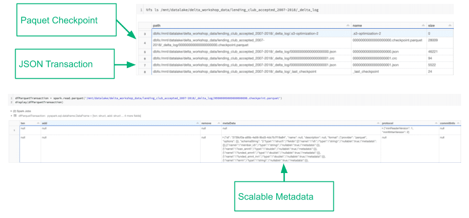

## Delta Table File Format

When you create tables with Spark SQL, you can specify the format you want in which you want to write the data. The change is as simple as:

*CREATE TABLE example_table USING PARQUET*

vs

*CREATE TABLE example_table USING DELTA*

And we have established that Delta files are really just Parquet files plus a transaction log. So, why Delta?

### Parquet File

Parquet data "looks" like the image shown here if we view it from a file system UI.

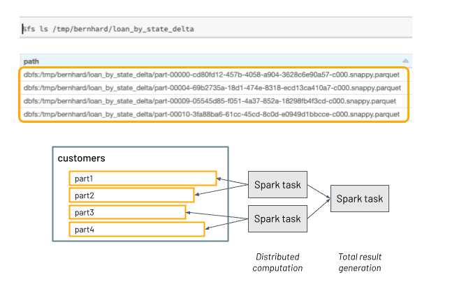

The Parquet format organizes data files into directories.  Applications interact with these directories as a unified collection of data. This hierarchical layout is optimized for distributed read and write operations. When there are computations to be made on that data, Spark breaks that work into tasks and the tasks can be working concurrently until the distributed computation is consolidated back into a single result.

Note: Parquet is optimized for append-only execution. You may update data by overwriting an entire partition. However, if that overwrite operation fails, it may result in data loss.

- Small File Problem
    
    Sometimes we end up with a lot of small files. This is often the result of lots of incremental updates and/or poor choices in partitioning. When we see this, it means that Spark has to do a lot of extra work to get at a relatively small amount of the data. For each of the little files, we need to have a task. Each tasks takes a little time to run. Considered together, this can add up to a significantly long time.
    
    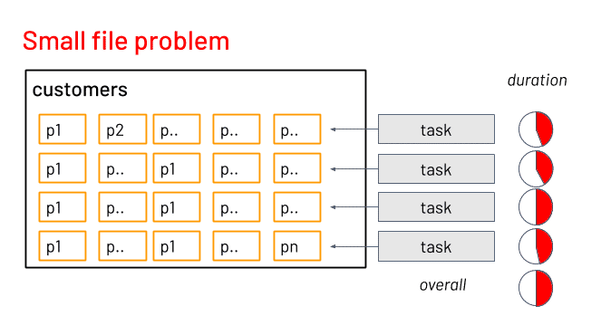
    
- Big File (skewed) Problem
    
    Data skew refers to an imbalanced distribution of data. In this example, we have a couple of small files and one very large one. Each task is assigned a section of the data and, for the two small files, the work is done very quickly. But the large file takes significantly longer and slows down the overall speed. In effect, it doesn't matter that the first two tasks were finished quickly, because we need all the pieces to return that single, consolidated result set.
    
    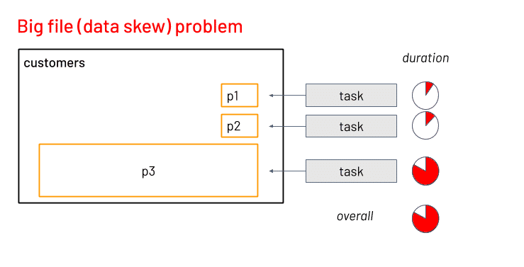
    
- Corrupt Data
    
    Sometimes bad data is added to the system. If we don't have appropriate checks built in, we can easily add files with an incompatible schema or corruption. If any task fails, the whole job fails.
    
    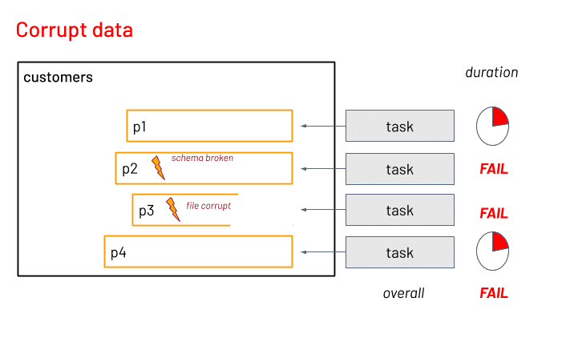
    

### Delta File

Delta has reliability and performance features built in that can solve common problems with the Parquet file format

- Guaranteed Consistency
    
    As we're writing batches of data (or streaming data) into storage, we use built-in schema enforcement to avoid reading broken, unfinished or wrong data. You can easily configure your data ingestion such that it only accepts a given schema, and you can even configure it to accept only values within a certain range or eliminate NULL values, for example.
    
    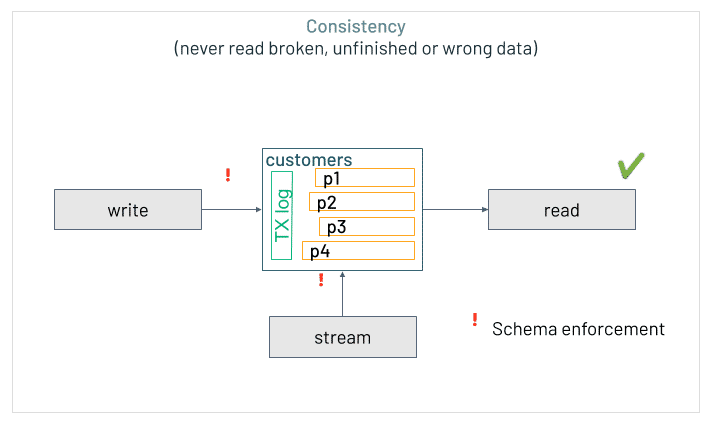
    
- Write Optimizations
    
    Delta is smart. Without you having to set up complex write pipelines, it can perform optimizations as the data comes in. If our ingest pipeline is about to write a bunch of small files, or about to write badly skewed data, Delta can automatically coalesce those files so that we end up with set of evenly distributed partial files of a decent size.
    
    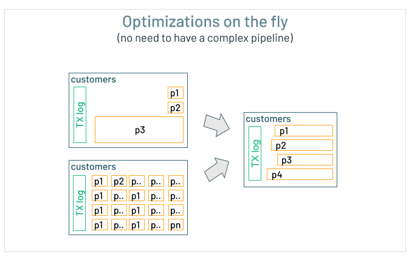
    
- Updates and Deletes
    
    Recall that Parquet is append only. Delta uses the transaction log to manage updates and deletes for you so that you can avoid setting up a complex pipeline yourself. This is especially helpful for meeting compliance standards and change data capture
    
    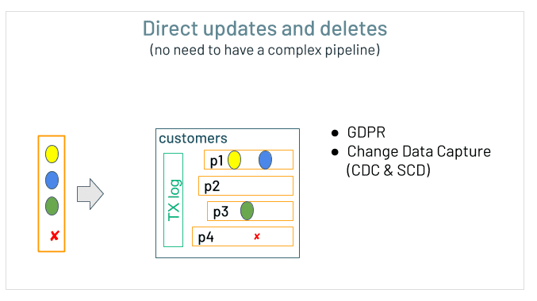
    
- Time Travel
    
    Recall that Parquet is append only. Delta uses the transaction log to manage updates and deletes for you so that you can avoid setting up a complex pipeline yourself. This is especially helpful for meeting compliance standards and change data capture
    
    
    

## The Transaction Log

The mechanism through which Delta Lake is able to offer the guarantee of atomicity.

### Atomic Commits

Whenever a user performs an operation to modify a table (like INSERT, UPDATE, or DELETE), Delta Lake breaks that operation down into a series of discrete steps composed of one or more of the actions.

Each action either completes fully or not at all.  Those actions are then recorded in the transaction log as ordered, atomic units known as commits.

For example, suppose a user creates a transaction to add a new column to a table plus add some more data to it. Delta Lake would break that transaction down into its component parts, and once the transaction completes, add them to the transaction log as the following commits:

1. Update metadata – change the schema to include the new column
2. Add file – for each new file added

### Multiple Concurrent Read & Writes

Everything we have learned about transaction logs so far has positioned the transaction log as a single, linear record. That is, the changes we are tracking and recording are assuming that there is a single reader or writer committing changes to our data. This is not realistic. Delta Lake is built to allow multiple users modifying a table concurrently.

**Optimistic vs Pessimistic concurrency**

Optimistic concurrency control is a method of dealing with concurrent transactions that assumes that transactions (changes) made to a table by different users can complete without conflicting with one another. It is incredibly fast because when dealing with petabytes of data, there’s a high likelihood that users will be working on different parts of the data altogether, allowing them to complete non-conflicting transactions simultaneously.

In contrast, pessimistic concurrency control assumes there will often be conflicts. If some part of the data is getting updated, the rest of it will be locked until the update is complete and access is restored. In a distributed system, this model can be very problematic.

**Solving problems optimistically**

In order to offer ACID transactions, Delta Lake has a protocol for figuring out how commits should be ordered, and determining what to do in the event that two or more commits are made at the same time.

Delta Lake handles these cases by implementing a rule of mutual exclusion, then attempting to solve any conflict optimistically.

In this example, 2 users read from the same table. They both get *000000.json*. Both append some data. There's a conflict - both users cannot commit *000001.json*.  Delta Lake handles this with "mutual exclusion. User 1 commit is accepted and User 2 is rejected. Instead of throwing an error, it checks for new commits, silently updates the table if necessary, and processed User 2's commit on the newly updated table.

## Optimizations with Delta Engine

Recall that Delta Engine is the high-performance query engine we use to access data in your Delta Lake.

### Optimize

You can run OPTIMIZE on your existing data to help fix stored skewed data. Optimize will look at the size of each file and coalesce them to help prevent data skew. When we do, we can use another optimization, called zordering, to help organize the coalesced data in the most performant way for the values we expect to be filtered most frequently

### Z-Ordering

Z-ordering aims to make the organization of the data in your file more efficient by colocating related data.  If Delta understands how your data is organized (like it does with partitioning) it can skip reading in files that are unnecessary for your query.  It is not idempotent; it is incremental and must be combined with the OPTIMIZE command.

If you expect a column to be commonly used in query predicates and if that column has high cardinality (that is, a large number of distinct values), then use ZORDER BY.

You can specify multiple columns for ZORDER BY as a comma-separated list. However, the effectiveness of the locality drops with each additional column. Z-Ordering on columns that do not have statistics collected on them would be ineffective and a waste of resources as data skipping requires column-local stats such as min, max, and count. You can configure statistics collection on certain columns by re-ordering columns in the schema or increasing the number of columns to collect statistics on.

### Auto-Optimize

Auto Optimize is an optional set of features that automatically compact small files during individual writes to a Delta table. Paying a small cost during writes offers significant benefits for tables that are queried actively. Auto Optimize is particularly useful in the following scenarios:

- Streaming use cases where latency in the order of minutes is acceptable
- *MERGE INTO* is the preferred method of writing into Delta Lake
- *CREATE TABLE AS SELECT* or *INSERT INTO* are commonly used operations

Auto Optimize consists of two complementary features: Optimized Writes and Auto Compaction. See [documentation](https://docs.databricks.com/delta/optimizations/auto-optimize.html#how-auto-optimize-works) for more details.

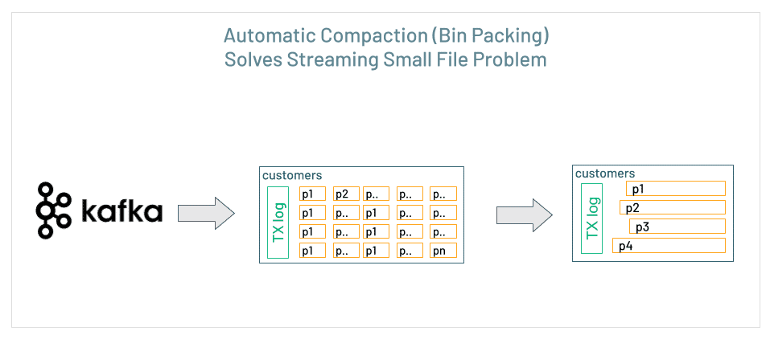