# Week 4: Data Transmission Pipelines with Cloud Pub/Sub and Cloud Dataflow


# Real-time IoT Dashboard with Pub/Sub, Dataflow and Data Studio

Welcome to the module on real-time IoT dashboards. We'll highlight and solve the challenges of streaming data processing. We'll first look at the challenges that give today's data engineers headaches, from trying to set up and manage their own pipelines. Then we'll examine how we can capture all of these streaming messages and wrangle them into a reliable, global, and scalable way, into our pipeline. After we've captured those streaming messages, we'll show you how you can build serverless data pipelines for streaming that data using Google Cloud Platform Tools. How can I design and control the pipeline for scale if I need to? We'll cover all of that in our sections on Apache Beam and Cloud Dataflow, which are popular ways to design and implement these kinds of pipelines respectively. Last, once we've captured, processed and then stored the data, we'll then see how we can visualize our insights with reporting dashboards. Building scalable and reliable pipelines is a core responsibility for data engineers.


# Message-Oriented Architectures

Whatever the use case is, we have to tackle these four primary components. Streaming data from various devices or processes that may not even talk to each other and even they could send bad data or data that's delayed, it's number one. Number two, we never way of not only knowing and collecting these streaming messages in some sort of buffer, but also allow other services to subscribe to new messages that we're publishing out. Naturally, the service needs to handle an arbitrarily high amount of data so we don't lose any messages coming in, and it has to be reliable. We need all the messages and also a way to remove any duplicates if found.


One tool to handle distributed message-oriented architectures like what we've been talking about at a scalable way is Cloud Pub/Sub. At its core, Pub/Sub is a distributed messaging service that can receive messages from a variety of different streams, upstream data systems like gaming events, IoT devices, applications streams, and more. It ensures at least once delivery of messages and passes them to subscribing applications and no provisioning is required. Where there's a ton of messages or none at all, Pub/Sub will scale to meet that demand. Also, the APIs are open, and the service is global by default and offers end-to-end encryption for those messages.

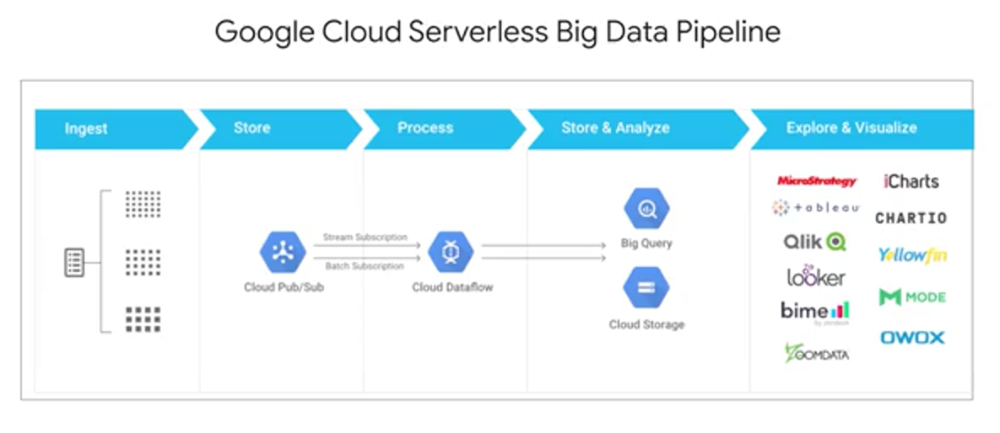

Upstream data starts in from the left and comes into those devices from all around the globe. It is then ingested into Cloud Pub/Sub as a first point of contact with our system. Cloud Pub/Sub reads, stores, and then publishes out any subscribers of this particular topic. We'll talk about topics soon that these new messages are available. Cloud Dataflow as a subscriber to this pub subtopic in particular can then say, "Hey, you got messages? Let me take them." It'll ingest and transform those messages in an inelastic streaming pipeline. You can output those messages wherever you want. If you're doing analytics one common data sync is Google BigQuery. Lastly, you can connect a data visualization tool like Tableau, Looker, or Data Studio to visualize and monitor the results of your streaming data pipeline. Next, we'll talk more about the architecture of Pub/Sub.

## Topics

A central piece of Pub/Sub is the topic. You can think of a topic like a radio antenna. Whether your radio is blasting music or it's turned off, the antenna itself is always there. If the music is being broadcast at a frequency that's no one's listening to, the streaming music still exists. Similarly, a publisher can send data to a topic that has no subscriber to receive it. Or the inverse, a subscriber could be waiting to hear data from a topic that isn't getting any data sent into it. That's kind of like listening to all that static and a bad radio frequency. Or you can have a fully operational pipeline where the publisher is sending data to a topic that an application that has subscribed to and it's pulling from. To recap, there can be zero, one, or many publishers and zero, one, or many many subscribers relating to any given Pub/Sub topic, and they're completely decoupled from each other. So they're free to break without affecting their counterparts.

Pub/Sub is that good solution to buffering changes from those lightly coupled architectures like this one here with many different upstream sources and potentially many different downstream sinks or subscribers. It supports many different inputs and outputs, and you can even publish from one Pub/Sub event them from that topic to yet another Pub/Sub subtopic should you wish.

# Serverless Data Pipelines

Here's a quick mental framework for the two problems that we needed to solve as a data engineer, building our pipeline. Looks like an architect, drawing a blueprint and then eventually building the house or building. We have to solve for number one, the design of the actual pipeline in code. Number two, the actual implementation in serving of that pipeline at scale in production. Here are some of the common questions to ask in each of these phases.

For a pipeline design, is the code we're going to write compatible with both batch and streaming data? Or would we need to do any refactoring? Does the pipeline code SDK or using have all the transformations mid fight aggregations and windowing functionality, and does it have the ability to handle late data coming into the pipeline? Lastly, for design are there any existing templates or solutions that we can leverage to quickly get us started? One popular open source solution that we talked a bit about earlier in the course, is building pipelines with Apache Beam. It works with both batch and streaming data, and has an ever-expanding list of transformations and functions, that are committed and added to its open source repository.

## Apache Beam

Apache Beam is a portable data processing programming model. It's open source, and it can be ran in a highly distributed fashion. It's unified and that is single model, meaning your pipeline code can work for both batch and streaming data. You're not locked into a vendor because the code is portable and can work on multiple execution environments like Cloud Dataflow or Apache Spark among others. It's extensible and open source. You can browse and write your own connectors, and build transformation libraries too if you wanted. Apache Beam pipelines are written in Java, Python or Go. The SDK provides a host of libraries for transformations and existing data connectors to sources and sinks. Apache Beam creates a model representation of your code, which is portable across many runners. Runners pass off your model to an execution environment, which you could run in many different possible engines. Cloud Dataflow is one of the popular choices for running Apache Beam as an engine.

Here's what an actual pipeline looks like using the Apache Beam SDK, running on Cloud Dataflow as an engine. Each step in the pipeline, there's a filter, a group, transform, compare, join and so on, and at the critical point is that transformations can be done in parallel, which is how you get that truly elastic pipeline. In the code snippet here, c.element, gets the input, and then c.output, sends the output to the next step of the pipeline. You can get input from many different and even multiple sources concurrently, then you can write output to many different sinks, and the pipeline code remains the same. You can put this code inside of a circle, deploy it to App Engine and schedule a Cron Task Que in App Engine to execute the pipeline code periodically. But what if you didn't want to manage the infrastructure running the pipeline? We'll see now how next, you can implement your pipeline code at scale with low maintenance.

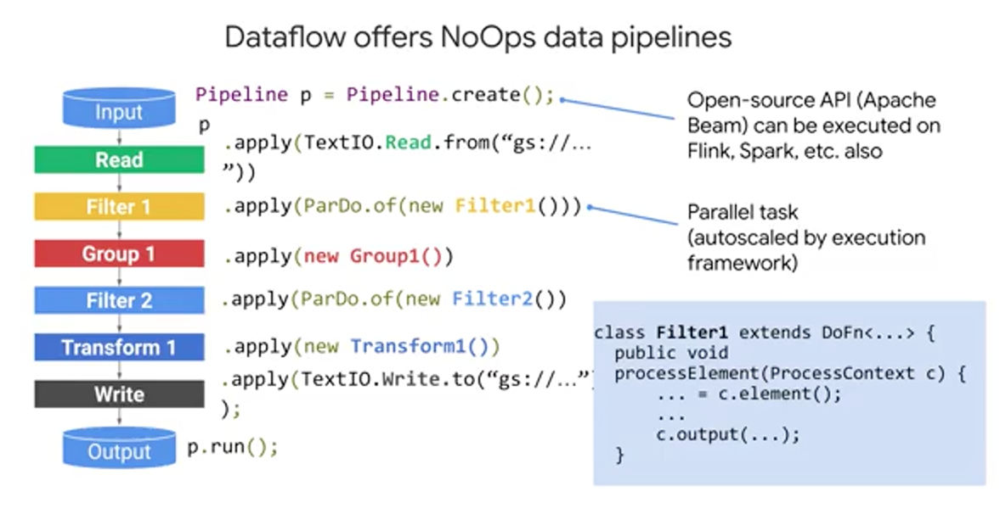

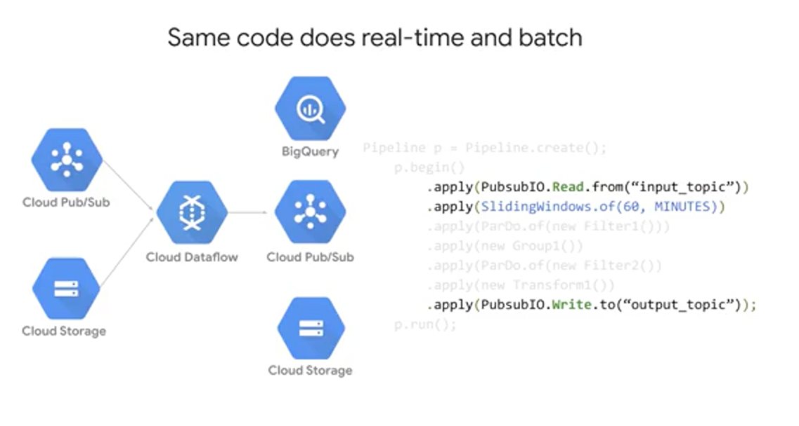

## Cloud Dataflow

Now that you've seen the pipeline design and code, it's time to talk about implementing it at scale for your production data pipelines. When shopping around for execution engines for your pipeline code, consider these questions: How much maintenance overhead is involved? Is the infrastructure itself reliable? How is scaling handled? How can I monitor an alert on things in my pipeline? And am I locked in to a vendor?

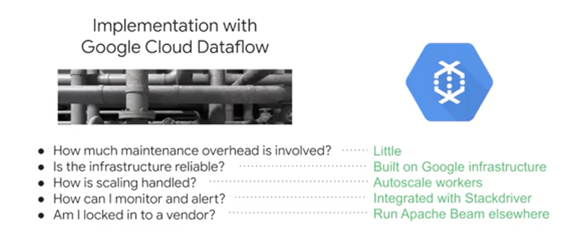

With Cloud Dataflow a lot of the complexity of infrastructure's setup and maintenance is handled automatically for you. It's built on top of Google's infrastructure and it autoscales to meet the demands of your data pipelines. It's also tightly coupled with other Google Cloud Platform projects like Stackdriver. So you can set up priority alerts and notifications to keep a watchful eye on your pipeline and the quality of data that's coming in and out. You can replace all the various data handling tools with just Dataflow. Many Hadoop workloads can be done easily and more maintainably with Dataflow. Plus, Dataflow is serverless and designed to be NoOps.

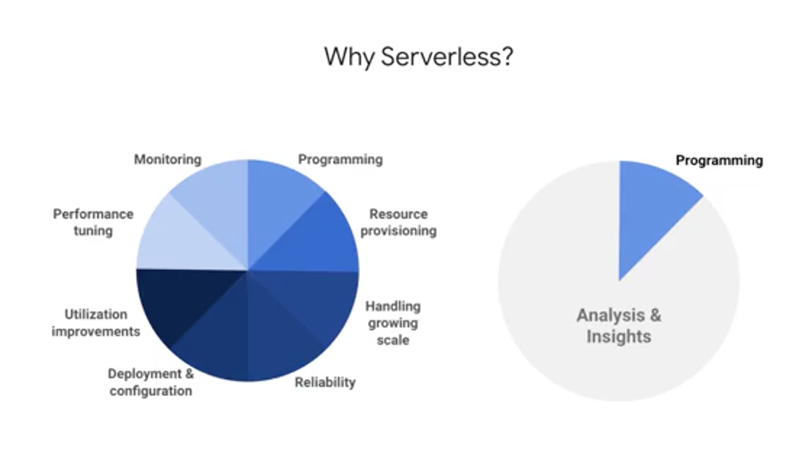

So what does Cloud Dataflow do with the job?


Once it receives it, the Cloud Dataflow service optimizes the execution graph of your model to remove inefficiencies. It schedules out work and the distributed fashion to workers and scales as needed. It will auto-heal in the event of faults with those workers. It will re-balance automatically to best utilize the underlying workers. And it'll connect to a variety of data syncs to produce a result. BigQuery is just one of the many syncs that you can output data to, as you'll practice inside of your lab. What you won't see, by design, is all the compute and storage resources that Cloud Dataflow is managing for you elastically to fit the demand of your streaming data pipeline. That's fully managed. And even if you're a seasoned Java or Python developer, it's still a good idea to start from many of the existing Dataflow templates that cover common use cases across Google Cloud platform products.


See whether or not there is an existing template for you to work from. For IoT use cases Pub Sub through Dataflow into BigQuery already exists and it's a popular choice.

It's designed to be easy to deploy your pipeline and have it just run. It's serverless and fully managed. Same code can both batch and streaming at scale. It's built on Apache Beam's open source programming model. And it can autoscale, auto-heal, and re-balance to millions of queries per second.

# Data Visualization with Data Studio

Data visualization is a powerful tool to let you explore your data also before presenting your results. Speaking of exploration, a new and popular way to explore your datasets is available right within BigQuery. After you execute a query, you could explore in Data Studio to immediately start creating visuals or explore as part of building a dashboard. 

The role of your report should be to highlight the key insights that your audience cares about. Don't show them everything, focus and filter their attention to just what those data points or those insights that they need to be seeing right then. Telling a good story with your data on your dashboard is critical because your users are likely not going to care about that amazing pipeline you just built, if the output of the dashboard is ugly and hard to use.

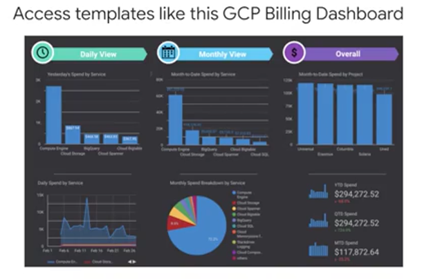

Data Studio comes with pre-built templates like this one that monitors your GCP Billing in a dashboard. You can even connect this one to your own GCP account to monitor your own spending and do some fun analysis like track incoming BigQuery jobs and the amount of data that those queries are processing.

The Data Studio homepage shows the dashboards and the data sources that you have access to. It's an important distinction between the two. Connected data sources can feed into dashboards but just because somebody has access to your dashboard, doesn't mean they automatically are granted permission to view the underlying data that's presented, because that could be controlled in BigQuery or elsewhere in your GCP project.


The first thing you need to do is tell Data Studio where your data is coming from. That again is known as the data source. A Data Studio report can have any number of data sources but we'll just start with one. The data source picker shows all the data sources that you have access to. Note that you can have any or all of these data sources in a single Data Studio report. Since Data Studio reports and datasets can be shared, you should be aware of the ramifications of adding a new data source. When you add a data source to a report, other people who can view the report, can potentially see all the data in that data source if you share that data source with them. Anyone who can edit the report can also use all the fields from any added data sources to create new charts with them. You can click "Add to Report" to connect the data source and then you're ready to start visualizing.

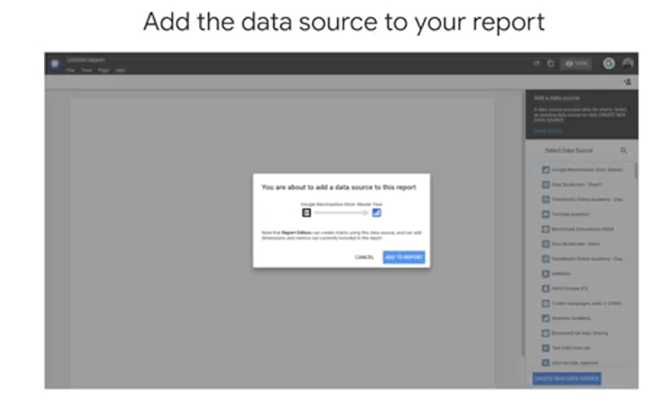

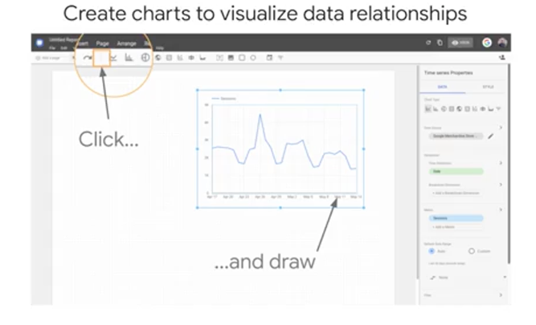


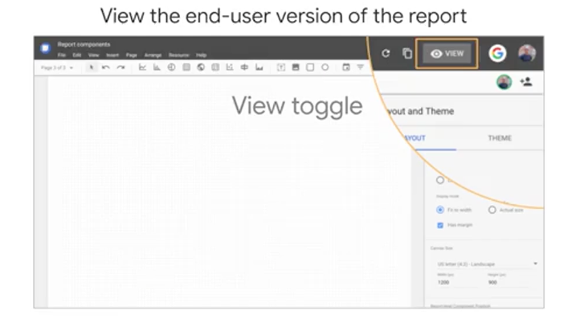

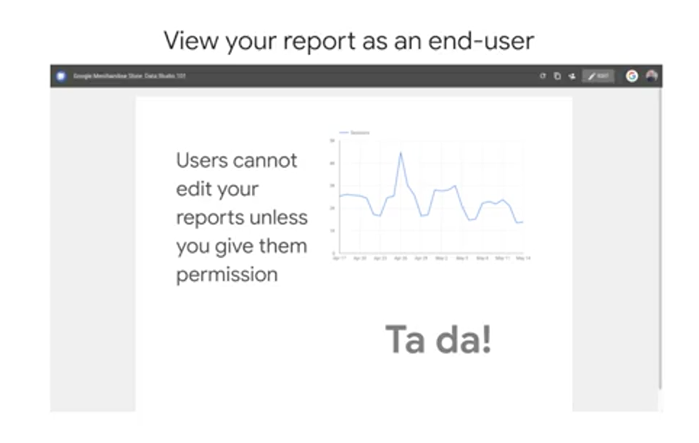

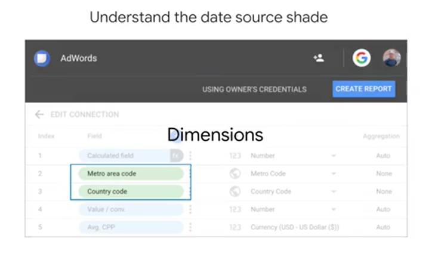

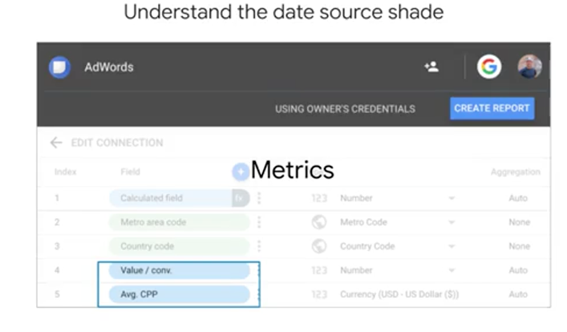

Note that you can mouse over any of the charts and graphs on the report. This is live data, it's not just a static image. So this report may not look like much, but with just a few mouse clicks, you can connect to a data source like Google Analytics and create a chart graphing session data over time. A few more key things to know, Dimension chips are green. Dimensions are things like categories or buckets of information. Dimension values could be things like names, descriptions, or other characteristics of a category. Metric chips are blue. Metrics measure dimension values. Metrics represent measurements or aggregations such as a sum, x plus y, a count, how many of x, or even a ratio, x over y. You can even create simple metrics through calculated fields, like field one plus field two.

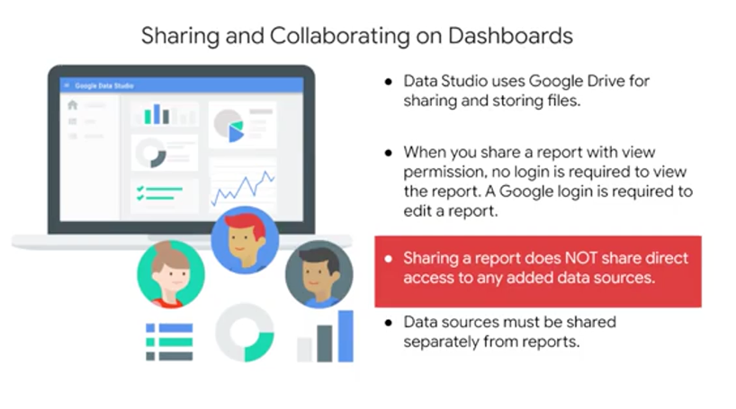

Lastly, you can share and collaborate your dashboards with your team. Keep in mind that when you share a report, if you're connected to an underlying data source like a BigQuery data set, Data Studio does not automatically grant permissions to viewers and that data source if the viewer doesn't already have them and this is for data security reasons. After you share your report, users can interact with filters and sort, and then you can collect feedback on the usage of your report through Data Studio's native integration with Google Analytics.

# Module Resources

- [Documentación de Cloud Pub/Sub](https://cloud.google.com/pubsub/docs/?hl=es-419) y [blog](https://cloud.google.com/pubsub/docs/release-notes?hl=es-419)
- [Documentación de Cloud Dataflow](https://cloud.google.com/dataflow/docs/?hl=es-419), [blog](https://cloud.google.com/blog/products/data-analytics/) y [plantillas](https://github.com/googlecloudplatform/dataflowtemplates/)
- [Documentación de Data Studio](https://developers.google.com/datastudio/?hl=es-419) y [plantillas](https://datastudiogallery.appspot.com/gallery)

# Code

```sql
WITH streaming_data AS (

SELECT
  timestamp,
  TIMESTAMP_TRUNC(timestamp, HOUR, 'UTC') AS hour,
  TIMESTAMP_TRUNC(timestamp, MINUTE, 'UTC') AS minute,
  TIMESTAMP_TRUNC(timestamp, SECOND, 'UTC') AS second,
  ride_id,
  latitude,
  longitude,
  meter_reading,
  ride_status,
  passenger_count
FROM
  taxirides.realtime
WHERE ride_status = 'dropoff'
ORDER BY timestamp DESC
LIMIT 100000

)

# calculate aggregations on stream for reporting:
SELECT
 ROW_NUMBER() OVER() AS dashboard_sort,
 minute,
 COUNT(DISTINCT ride_id) AS total_rides,
 SUM(meter_reading) AS total_revenue,
 SUM(passenger_count) AS total_passengers
FROM streaming_data
GROUP BY minute, timestamp
```